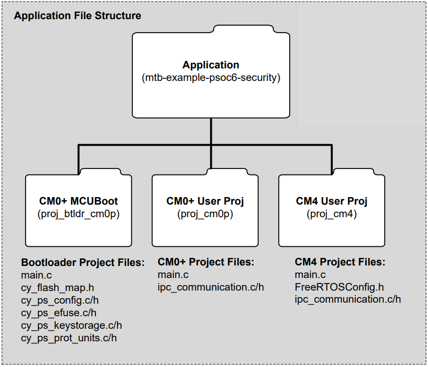
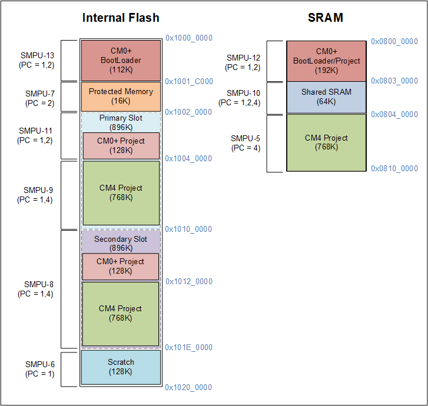
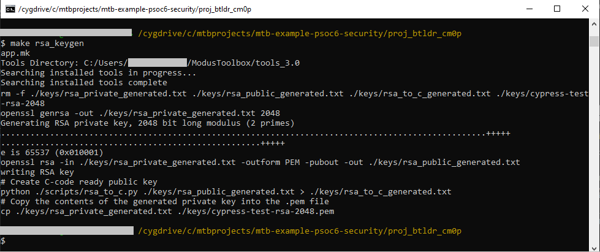
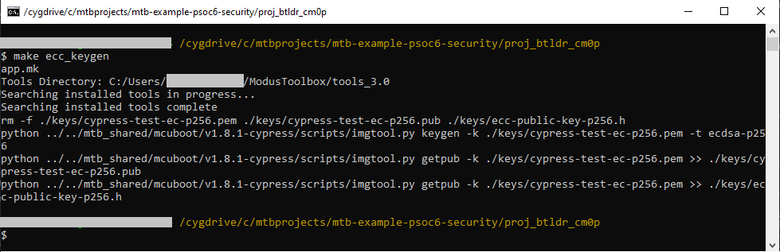

# PSoC&trade; 6 MCU: Security application template

This is a minimal starter dual-CPU security application template for PSoC&trade; 62/63 MCU devices. This code example is meant to be a companion to the [AN221111 – PSoC&trade; 6 MCU: Designing a secured system](https://www.infineon.com/an221111) application note. It demonstrates the following features to create a secured system as explained in the application note.

- Bootloader based on the industry-standard MCUboot (CM0+)
- Cryptographically signed bootloader
- Dual-CPU operation; user applications for both CM0+ and CM4
- Supports Device Firmware Update (DFU) with standard UART interface
- FreeRTOS running on CM4
- Signed CM0+ and CM4 application bundle
- Full Chain of Trust
- Isolated CPUs using SMPU

The template bundles three applications:

- **bootloader_cm0p** – Implements an MCUboot-based basic bootloader application run by CM0+. The bootloader handles image authentication and upgrades. When the image is valid, the bootloader lets the user app bundle (CM0+/CM4 user image) and run the image by passing the starting address of the image to it. It also programs the protection units and other system security related features.

- **cm0p_app** – Implements a blinky LED application run by CM0+ that toggles the user LED at different rates depending on whether it was built in BOOT mode or UPGRADE mode.

- **cm4_app** – Implements a DFU task to receive firmware updates over UART using FreeRTOS. It also demonstrates the usage of IPCs to request data from the CM0+ app. This application is merged with the *cm0p_app* image to generate the dual-CPU image to be programmed.

   You can build the CM0+ and CM4 user application in one of the following ways:

   - **BOOT mode:** The application image is built to be programmed into the primary slot. The bootloader will simply boot the application on the next reset.

   - **UPGRADE mode:** The application image is built to be programmed into the secondary slot. Based on the user input, the bootloader will copy the image into the primary slot and boot it on the next reset.

The template also bundles a directory shared across all applications:

- **shared** – Contains the linker scripts and configuration makefile (*shared_config.mk*) for all supported BSPs. The macros defined in the linker scripts are supplied by this configuration makefile.

[View this README on GitHub.](https://github.com/Infineon/mtb-example-psoc6-security)

[Provide feedback on this Code Example.](https://cypress.co1.qualtrics.com/jfe/form/SV_1NTns53sK2yiljn?Q_EED=eyJVbmlxdWUgRG9jIElkIjoiQ0UyMzQ5OTIiLCJTcGVjIE51bWJlciI6IjAwMi0zNDk5MiIsIkRvYyBUaXRsZSI6IlBTb0MmdHJhZGU7IDYgTUNVOiBTZWN1cml0eSBhcHBsaWNhdGlvbiB0ZW1wbGF0ZSIsInJpZCI6ImRka2EiLCJEb2MgdmVyc2lvbiI6IjEuMC4wIiwiRG9jIExhbmd1YWdlIjoiRW5nbGlzaCIsIkRvYyBEaXZpc2lvbiI6Ik1DRCIsIkRvYyBCVSI6IklDVyIsIkRvYyBGYW1pbHkiOiJQU09DIn0=)

<br>

<details><summary><span style="font-size:1.6em;">Table of contents</span></summary>

- [PSoC&trade; 6 MCU: Security application template](#psoc-6-mcu-security-application-template)
  - [Requirements](#requirements)
  - [Supported toolchains (make variable 'TOOLCHAIN')](#supported-toolchains-make-variable-toolchain)
  - [Supported kits (make variable 'TARGET')](#supported-kits-make-variable-target)
  - [Hardware setup](#hardware-setup)
  - [Software setup](#software-setup)
  - [Using the code example](#using-the-code-example)
    - [In Eclipse IDE for ModusToolbox&trade; software:](#in-eclipse-ide-for-modustoolbox-software)
    - [In command-line interface (CLI):](#in-command-line-interface-cli)
    - [In third-party IDEs:](#in-third-party-ides)
  - [Operation](#operation)
    - [Step-by-step instructions](#step-by-step-instructions)
  - [Debugging](#debugging)
  - [Design and implementation](#design-and-implementation)
  - [Project structure](#project-structure)
  - [Project configuration](#project-configuration)
    - [Flash memory layout](#flash-memory-layout)
    - [SRAM memory layout](#sram-memory-layout)
    - [Configuring the common make variables](#configuring-the-common-make-variables)
      - [Build control variables](#build-control-variables)
      - [Memory layout variables](#memory-layout-variables)
  - [Bootloader implementation](#bootloader-implementation)
    - [MCUboot basics](#mcuboot-basics)
    - [Swap-based upgrade for PSoC&trade; 6 MCU](#swap-based-upgrade-for-psoc-6-mcu)
    - [Flash map/partition](#flash-mappartition)
      - [Customizing the flash map](#customizing-the-flash-map)
    - [Configuring bootloader make variables](#configuring-bootloader-make-variables)
  - [CM0+ blinky user app implementation](#cm0-blinky-user-app-implementation)
    - [Protected storage](#protected-storage)
    - [Configuring CM0+ app make variables](#configuring-cm0-app-make-variables)
  - [CM4 FreeRTOS user app implementation](#cm4-freertos-user-app-implementation)
    - [Protected Storage](#protected-storage-1)
    - [Device Firmware Update (DFU)](#device-firmware-update-dfu)
    - [Configuring CM4 app make variables](#configuring-cm4-app-make-variables)
  - [Security overview](#security-overview)
    - [Secured boot](#secured-boot)
    - [Protection units](#protection-units)
    - [eFuse programming for debug access restrictions and lifecycle](#efuse-programming-for-debug-access-restrictions-and-lifecycle)
    - [MCUboot security](#mcuboot-security)
    - [Generating a key pair](#generating-a-key-pair)
      - [Generating an RSA key pair](#generating-an-rsa-key-pair)
      - [Generating the ECC key pair](#generating-the-ecc-key-pair)
  - [Pre and post-build steps](#pre-and-post-build-steps)
    - [Bootloader app: Pre-build steps](#bootloader-app-pre-build-steps)
    - [Bootloader app: Post-build steps](#bootloader-app-post-build-steps)
    - [CM0+/CM4 dual-CPU user app: Post-build steps (for development)](#cm0cm4-dual-cpu-user-app-post-build-steps-for-development)
    - [CM0+/CM4 dual-CPU user app: Post-build steps (for production)](#cm0cm4-dual-cpu-user-app-post-build-steps-for-production)
  - [Bootloader app: Custom device configuration](#bootloader-app-custom-device-configuration)
  - [CM4 user app: Custom device configuration](#cm4-user-app-custom-device-configuration)
  - [Related resources](#related-resources)
  - [Other resources](#other-resources)
  - [Document history](#document-history)

</details>

<br>

## Requirements

- [ModusToolbox&trade; software](https://www.infineon.com/cms/en/design-support/tools/sdk/modustoolbox-software/) v2.4
- Board Support Package (BSP) minimum required version: 2.0.0
- Programming language: C
- [CYPRESS&trade; programmer](https://www.cypress.com/products/psoc-programming-solutions)
- Associated parts: All [PSoC&trade; 6 Dual-CPU MCU](https://www.infineon.com/cms/en/product/microcontroller/32-bit-psoc-arm-cortex-microcontroller/psoc-6-32-bit-arm-cortex-m4-mcu/) parts (except PSoC&trade; 64)

## Supported toolchains (make variable 'TOOLCHAIN')

- GNU Arm® Embedded Compiler v9.3.1 (`GCC_ARM`) - Default value of `TOOLCHAIN`

## Supported kits (make variable 'TARGET')

- [PSoC&trade; 6 Wi-Fi Bluetooth&reg; prototyping kit](https://www.cypress.com/CY8CPROTO-062-4343W) (`CY8CPROTO-062-4343W`)
- [PSoC&trade; 6 WiFi-BT pioneer kit](https://www.cypress.com/CY8CKIT-062-WiFi-BT) (`CY8CKIT-062-WIFI-BT`) - Default value of `TARGET`
- [PSoC&trade; 6 Bluetooth&reg; LE pioneer kit](https://www.cypress.com/CY8CKIT-062-BLE) (`CY8CKIT-062-BLE`)
- [PSoC&trade; 6 Bluetooth&reg; prototyping kit](https://www.cypress.com/CY8CPROTO-063-BLE) (`CY8CPROTO-063-BLE`)
- [PSoC&trade; 62S2 Wi-Fi Bluetooth&reg; pioneer kit](https://www.cypress.com/CY8CKIT-062S2-43012) (`CY8CKIT-062S2-43012`)
- [PSoC&trade; 62S3 Wi-Fi Bluetooth&reg; prototyping kit](https://www.cypress.com/CY8CPROTO-062S3-4343W) (`CY8CPROTO-062S3-4343W`)

## Hardware setup

This example uses the board's default configuration. See the kit user guide to ensure that the board is configured correctly.

**Note:** ModusToolbox&trade; software requires KitProg3. Before using this code example, make sure that the board is upgraded to KitProg3. The tool and instructions are available in the [Firmware Loader](https://github.com/Infineon/Firmware-loader) GitHub repository.

If you do not upgrade, you will see an error like "unable to find CMSIS-DAP device" or "KitProg firmware is out of date".

## Software setup

Install a terminal emulator if you don't have one. Instructions in this document use [Tera Term](https://ttssh2.osdn.jp/index.html.en).

This example requires no additional software or tools.

## Using the code example

### In Eclipse IDE for ModusToolbox&trade; software:

1. Click the **New Application** link in the Quick Panel (or, use **File** > **New** > **ModusToolbox&trade; Application**).

2. Pick a kit supported by the code example from the list shown in the **Project Creator - Choose Board Support Package (BSP)** dialog.

   When you select a supported kit, the example is reconfigured automatically to work with the kit. To work with a different supported kit later, use the **Library Manager** to choose the BSP for the supported kit. You can use the Library Manager to select or update the BSP and firmware libraries used in this application.

   To access the Library Manager, right-click the application name from the Project Workspace window in the IDE, and select **ModusToolbox** > **Library Manager**. You can also access it from the **Quick Panel**.

   You can also just start the application creation process again and select a different kit.

   If you want to use the application for a kit not listed here, you may need to update the source files. If the kit does not have the required resources, the application may not work.

3. In the **Project Creator - Select Application** dialog, choose the example by enabling the checkbox.

4. (Optional) Change the suggested **New Application Name**.

5. The **Application(s) Root Path** defaults to the Eclipse workspace which is usually the desired location for the application. If you want to store the application in a different location, you can change the *Application(s) Root Path* value. Applications that share libraries should be in the same root path.

6. Click **Create** to complete the application creation process.

For more details, see the [Eclipse IDE for ModusToolbox&trade; software user guide](https://www.cypress.com/MTBEclipseIDEUserGuide) (locally available at *{ModusToolbox&trade; software install directory}/ide_{version}/docs/mt_ide_user_guide.pdf*).


### In command-line interface (CLI):

1. Download and unzip this repository onto your local machine, or clone the repository.

2. Open a CLI terminal and navigate to the application folder.

   On Linux and macOS, you can use any terminal application. On Windows, navigate to the modus-shell directory (*{ModusToolbox install directory}/tools_\<version>/modus-shell*) and run *Cygwin.bat*.

3. Navigate to each application and execute the `make getlibs` command to import the required libraries.

    ```
    cd bootloader_cm0p
    make getlibs
    ```
    ```
    cd cm0p_app
    make getlibs
    ```
    ```
    cd cm4_app
    make getlibs
    ```


### In third-party IDEs:

1. Follow the instructions from the [CLI](#in-command-line-interface-cli) section to download or clone the repository, and import the libraries using the `make getlibs` command.

2. Export the application to a supported IDE using the `make <ide>` command.

   For example, the application can be exported to an Eclipse-based IDE such as ModusToolbox&trade; software using the `make eclipse` command.

3. Follow the instructions displayed in the terminal to create or import the application as an IDE project.

For more details, see the "Exporting to IDEs" section of the ModusToolbox&trade; software user guide: *{ModusToolbox install directory}/ide_{version}/docs/mtb_user_guide.pdf*.


## Operation

This example bundles three applications - the bootloader app run by CM0+ CPU, the blinky app run by CM0+ CPU and the FreeRTOS application run by CM4 CPU.

The example can be built in two different ways:
- *For development* (default) – Used for developing the application and testing it

- *For production* – Used when firmware testing is complete and device is ready to deployed onto the field

The steps remain similar for both methods except that during production build, an additional post-build step is executed to merge the HEX files of all the applications to create a single binary. See [CM0+/CM4 user app post-build steps for production](#cm0cm4-dual-cpu-user-app-post-build-steps-for-production).

You need to build and program the applications in the following order. Do not start building the applications yet: follow the [Step-by-step instructions](#step-by-step-instructions):

1. **Build and program the bootloader app** – On next reset, CM0+ runs the bootloader app and prints a message that no valid image has been found.

2. **Build the blinky app in BOOT (default) mode** – A CM0+ binary will be generated on successful build.

3. **Build and program the FreeRTOS app in BOOT (default) mode** – The CM4 binary gets generated that integrates the CM0+ binary on a successful build. Once programmed, the bootloader will find that the user application exists and then transfer control to it if the validation is successful. The blinky and FreeRTOS applications will be running on the CM0+ and CM4 CPUs respectively with debug messages printed on the serial terminal.

4. **Build the blinky app in UPGRADE mode** – A CM0+ binary will be generated on a successful build.

5. **Build and program the FreeRTOS app in UPGRADE mode** – The CM4 binary is generated that integrates the CM0+ binary on a successful build. The DFU UART connections must be done as explained in [Table 5: DFU status LED and UART connections](#cm4-freertos-user-app-implementation). The [DFU Host tool](https://www.infineon.com/dgdl/Infineon-ModusToolbox_Device_Firmware_Update_Host_Tool_(Version_1.1)-Software-v01_00-EN.pdf?fileId=8ac78c8c7e7124d1017ed92bdbb22be3) is used to transfer the image over UART. Once the transfer is complete, the bootloader will find that the upgrade image exists and then either overwrite the primary slot or swap the primary slot with the new image based on the value of `SWAP_UPGRADE`. The blinky and FreeRTOS applications will be running on the CM0+ and CM4 CPUs respectively with debug messages printed on the serial terminal.


### Step-by-step instructions

<details><summary><b>For development</b></summary>

The *bootloader_cm0p* app design is based on MCUboot, which uses the [imgtool](https://pypi.org/project/imgtool/) Python module for image signing and key management.

1. Connect the board to your PC using the provided USB cable through the KitProg3 USB connector. Open a terminal program and select the KitProg3 COM port. Set the serial port parameters to 8N1 and 115200 baud.

2. Build and program the bootloader application. When programming consecutively, make sure to erase the device first before re-programming.

   <details><summary><b>Using Eclipse IDE for ModusToolbox&trade; software</b></summary>

      1. Select the *bootloader_cm0p* application in the Project Explorer.

      2. In the **Quick Panel**, scroll down, and click **\<Application Name> Program (KitProg3)**.

   </details>

   <details><summary><b>Using CLI</b></summary>

     From the terminal, go to the *bootloader_cm0p* directory and execute the `make program` command to build and program the application using the default toolchain to the default target.

     You can specify a target and toolchain manually using the following command:
      ```
      make program TARGET=<BSP> TOOLCHAIN=<toolchain>
      ```

      Example:
      ```
      make program TARGET=CY8CPROTO-062-4343W TOOLCHAIN=GCC_ARM
      ```

   </details>

   <details><summary><b>Using CYPRESS&trade; Programmer (for programming only)</b></summary>

     Use the following settings when programming the kit using CYPRESS&trade; Programmer.
     - Select **Reset chip**.
     - Deselect **Program Security Data**. (**Note:** When programming eFuse, this should be selected).
     - Set **Voltage** to 3.3 V. (**Note:** When programming eFuse, set this to 2.5 V.)
     - Set **Reset Type** as Soft.
     - Set **SFlash Restrictions** to "Erase/Program USER/TOC/KEY allowed".

     Specify the HEX file to be programmed and then click **Connect** and **Program**.

     **Figure 1. CYPRESS&trade; Programmer settings**

      

   </details>

   </br>

   After programming, the *bootloader* application starts automatically. Confirm that the UART terminal displays the current lifecycle state, access restrictions, status of protection units configuration and status of bootloader operation as highlighted in the figure.

   Note that the primary slot does not contain any valid image at this stage.

   **Figure 2. Bootloader starting with no bootable image**

   

   **Note:** If you do not see any message printed on the UART terminal (assuming that you have the right settings as mentioned in Step 1), it is most likely because the validation of the bootloader has failed. The bootloader image is signed with the RSA private key as part of the post-build steps. Ensure that the correct public key information that pairs with the private key is being used in the *cy_ps_keystorage.c* file. See [Generating and using keys](#generating-and-using-keys) for more information.

3. Build and program the *cm4_app* application (use one of the options as shown in Step 2 above). The *cm4_app* has the *cm0p_app* set as a dependent application in the Makefile using the `DEPENDENT_APP_PATHS` variable. This builds the *cm0p_app* along with the *cm4_app* every time to create the dual-CPU user image (*primary_app.hex*).

      After programming, the *bootloader_cm0p* application starts automatically. At this stage, the user application exists in the primary slot and control is transferred to it if the validation is successful. The UART terminal will display the following message based on the validation status:

   - If validation is successful:

      **Figure 3. Bootloader starting with a valid user image**

      

   - If validation fails:

      **Figure 4. Bootloader starting with an invalid user image**

      

   Note that the secondary slot does not contain any valid image at this stage.

4. If the user application is running successfully, the LED toggles on the kit to indicate a successful CM0+ startup. The UART terminal displays the successful startup of the CM4 application.

   **Note:** On kits with two LEDs, you should see the second LED glow indicating a successful CM4 startup. See [Table 5: DFU status LED and UART connections](#cm4-freertos-user-app-implementation) for LED pin assignment.

5. Edit the *shared_config.mk* file in the *shared* directory to create the UPGRADE image. Change the `IMG_TYPE` variable to UPGRADE.
   ```
   IMG_TYPE ?= UPGRADE
   ```

6. Build the *cm4_app* application. The applications have been developed to incorporate minor changes based on if `IMG_TYPE` is set to `BOOT` or `UPGRADE`. This builds the *cm0p_app* along with the *cm4_app* to create the dual-CPU user image. As part of the post-build steps, it signs the image using *imgtool* to create the user application bundle and then converts it to a *.cyacd2* file required by the DFU Host tool.

7. Connect an external MiniProg3/4 or KitProg3 programmer/debugger and make the connections required for the DFU UART as explained in [Table 5: DFU status LED and UART connections](#cm4-freertos-user-app-implementation).

8. Open the DFU Host tool (dfuh-tool) from the path: *{ModusToolbox install directory}/tools_\<version>/dfuh-tool*. Verify that you see the debugger probe. Choose the one that has UART on it as follows:

   

9. Select the *.cyacd2* file from the build output and click **Program**. The operation should take a few minutes to complete.

10. Once complete, the image validation status is displayed. If validation is successful, a software reset is initiated to boot it into the new image as follows. Else, the upgrade is aborted.
    
    
    
    Observe that the blinky LED is now blinking faster (every 250 ms) and the debug logs indicate the upgrade image being run.

11. Once the working of the bootloader and user application has been tested, you can blow the eFuses to transition from NORMAL to SECURE lifecycle mode for further testing. See [eFuse programming for debug access restrictions and lifecycle](#eFuse-programming-for-debug-access-restrictions-and-lifecycle).

12. Once the device is working as expected in SECURE lifecycle mode, proceed to [Step-by-step instructions for production build](#step-by-step-instructions) to program multiple devices at production level.

</details>

<details><summary><b>For production</b></summary>

The *bootloader_cm0p* app design is based on MCUboot, which uses the [imgtool](https://pypi.org/project/imgtool/) Python module for image signing and key management.

1. Connect the board to your PC using the provided USB cable through the KitProg3 USB connector. Open a terminal program and select the KitProg3 COM port. Set the serial port parameters to 8N1 and 115200 baud.

2. This step assumes that you have tested the working of your bootloader and your application in SECURE lifecycle stage during development. Edit the *bootloader_cm0p/source/cy_ps_efuse.h* file and set the `CY_EFUSE_AVAILABLE` macro to '1'.
   ```
   #define CY_EFUSE_AVAILABLE 1
   ```

3. Verify the eFuse configuration defined in the `cy_efuse_data` variable.

4. Build the bootloader application. This generates the *bootloader_cm0p.hex* file in the output build directory.

   <details><summary><b>Using Eclipse IDE for ModusToolbox&trade; software</b></summary>

      1. Select the *bootloader_cm0p* application in the Project Explorer.

      2. In the **Quick Panel**, scroll down, and click **Build \<Application Name>**.

   </details>

   <details><summary><b>Using CLI</b></summary>

     From the terminal, go to the *bootloader_cm0p* directory and execute the `make build` command to build the application using the default toolchain to the default target.

     You can specify a target and toolchain manually using the following command:
      ```
      make build TARGET=<BSP> TOOLCHAIN=<toolchain>
      ```

      Example:
      ```
      make build TARGET=CY8CPROTO-062-4343W TOOLCHAIN=GCC_ARM
      ```

   </details>

</br>

5. Navigate to the *cm4_app* directory and edit the Makefile to enable production build. Change `PRODUCTION` makefile variable to '1'.
   ```
   PRODUCTION=1
   ```

6. Build the *cm4_app* application. The *cm4_app* has the *cm0p_app* set as a dependent application in the Makefile using the `DEPENDENT_APP_PATHS` variable. This builds the *cm0p_app* along with the *cm4_app* every time to create the dual-CPU user image (*primary_app.hex*). Because production build is enabled, a merged HEX (*production.hex*) of all the three applications is also generated as part of the post-build steps. See [CM0+/CM4 dual-CPU user app post-build steps for production](#cm0cm4-dual-cpu-user-app-post-build-steps-for-production).

7. Program the merged HEX using CYPRESS&trade; Programmer. When programming consecutively, make sure to erase the device first before re-programming:

   1. Select the correct kit in the **Probe/Kit** option. Specify the *production.hex* file to be programmed and use the following settings:

      - Select **Reset chip**.
      - Select **Program Security Data**. (**Note:** When not programming eFuse, leave this deselected.)
      - Set **Voltage** to 2.5 V. (**Note:** When not programming eFuse, set this to 3.3 V.)
      - Set **Reset Type** to Soft.
      - Set **Sflash Restrictions** to "Erase/Program USER/TOC/KEY allowed".

      <br>

      **Note:** CYPRESS&trade; Programmer will indicate the current operating voltage at the bottom right as highlighted in the figure. If you do not see 2.5V even after setting the **Voltage** option to 2.5V, check if the kit has a VDD select switch / jumper and change it to 2.5V or 1.8V - 3.3V variable voltage.

      <br>

      **Figure 5. CYPRESS&trade; Programmer settings**

      

   2. Click **Connect** and then click **Program** to program the kit.

8. After programming, the *bootloader_cm0p* application starts automatically. At this stage, the user application exists in the primary slot and control is transferred to it if the validation is successful. The UART terminal displays the following message based on the validation status:

   - If validation is successful:

      **Figure 6. Bootloader starting with valid user image**

      

   - If validation fails:

      **Figure 7. Bootloader starting with invalid user image**

      

   Note that the secondary slot does not contain any valid image at this stage. This represents the state of the device on the field.

9. If the user application is running successfully, the LED should be toggling on the kit to indicate successful CM0+ startup. The UART terminal will display the successful startup of the CM4 application.

   **Note:** On kits with two LEDs, you should see the second LED light up indicating successful CM4 startup. See [Table 5: DFU status LED and UART connections](#cm4-freertos-user-app-implementation) for LED pin assignment.

10. Build the *cm4_app* application for `UPGRADE` by changing the `IMG_TYPE` to `UPGRADE` in *shared/shared_config.mk*. This represents the new firmware to be sent to the device on the field. The applications have been developed to incorporate minor changes based on whether `IMG_TYPE` is set to `BOOT` or `UPGRADE`. This builds the *cm0p_app* along with the *cm4_app* to create the dual-CPU user image. As part of the post-build steps, it signs the image using *imgtool* to create the user application bundle and then converts it to a *.cyacd2* file required by the DFU Host tool.

11. Connect an external MiniProg3/4 or KitProg3 and make the connections needed for the DFU UART as explained in [Table 5: DFU status LED and UART connections](#cm4-freertos-user-app-implementation).

12. Open the DFU Host tool (dfuh-tool) and verify that you are seeing the debugger probe. Choose the one that has UART on it as follows:

      

13. Select the *.cyacd2* file from the build output and click **Program**. The operation should take a few minutes to complete.

14. Once complete, the image validation status will be displayed. If validation is successful, a software reset is initiated to boot it into the new image as highlighted below. Else, the upgrade is aborted.

      

      Observe that the Blinky LED is now blinking faster (every 250 ms) and the debug logs indicate the upgrade image being run.

</details>

## Debugging

You can debug all the examples and step through the code. In the IDE, use the **\<Application Name> Debug (KitProg3)** configuration in the **Quick Panel**. For more details, see the "Program and debug" section in the Eclipse IDE for ModusToolbox User Guide: *{ModusToolbox install directory}/ide_{version}/docs/mt_ide_user_guide.pdf*.

## Design and implementation

This code example is meant to be a companion to the [AN221111 – PSoC&trade; 6 MCU: Designing a secured system](https://www.infineon.com/an221111) application note. The code example demonstrates several concepts such as the following:

- **Secure Boot** and **Chain of Trust**
- **Shared Memory Protection Units (SMPU)** for memory protection
- **Peripheral Protection Units (PPU)** for peripheral / memory protection
- **eFuses** for lifecycle transitions and lifecyle access restrictions
- **Protection Contexts (PC)** for bus master roles and enforcing access restrictions
- **Inter-Processor Communication (IPC)** for communication between the CPUs
- **MCUboot** bootloader functionality for validating and running images
- **Device Firmware Updates (DFU)** for updating the user image
- **Crypto** block usage for image validation

These concepts are covered in detail in the application note.

## Project structure

This template has three applications - *bootloader_cm0p*, *cm0p_app* and *cm4_app*. It also contains a *shared* directory that contains the configuration file (_shared_config.mk_) and linker scripts that are shared between the three applications.

**Figure 8. Project structure**




## Project configuration

The three applications rely on the configurations defined in the *shared/shared_config.mk* file. This file defines the start addresses and sizes for different memory regions and specifies certain common build configurations. The linker script symbols are also supplied by this file.

The partitions in the memory are created using the three linker scripts present in the *shared/linker_script/\<BSP>/TOOLCHAIN_GCC_ARM* directory.

File           | Description
---------------|------------
*COMPONENT_CM0P/\<device>_cm0p_btldr.ld*| Specifies the memory layout for the *bootloader_cm0p* application
*COMPONENT_CM0P/\<device>_cm0p.ld* | Specifies the memory layout for the *cm0p_app* application
*COMPONENT_CM4/\<device>_cm4.ld* | Specifies the memory layout for the *cm4_app* application

The linker scripts contain symbols that specify the starting address and length of each of the memory regions. The values for these symbols are supplied using the *shared_config.mk* file in the shared directory as explained below.


### Flash memory layout

The flash has been divided into the following sections:

- **Bootloader** – For running the MCUboot Bootloader application
- **Protected memory** – For storing confidential data or keys. See [Protected storage](#protected-storage) for more information.
- **Primary slot** – For running the CM0+ and CM4 user application
- **Secondary slot** – For storing the new dual-CPU firmware image
- **Scratch** (Supported only on PSoC&trade;6 2M) – For supporting MCUboot swap-based upgrade operation. See [Swap-based upgrade for PSoC&trade; 6 MCU](#swap-based-upgrade-for-psoctrade-6-mcu) for more information.

The flash memory layout is illustrated as follows for different memory variants of PSoC&trade; 62/63:

**Figure 9. Flash memory layout**


### SRAM memory layout

The SRAM has been divided into the following sections:

- **CM0+ bootloader/app** – Scratch-pad memory for CM0+ bootloader or CM0+ application. Note that this is shared because the SRAM region can be reused between the bootloader and the CM0+ user application.
- **Shared SRAM** – Used by both the CM0+ and CM4 for sharing any data.
- **CM4 app** – Scratchpad memory for CM4 application.

The SRAM memory map is illustrated below for different memory variants of PSoC&trade; 62/63:

**Figure 10. SRAM memory layout**


### Configuring the common make variables

This section explains the important make variables common to all three applications that affect their functionality. You can either update these variables directly in the Makefile or pass them along with the make build command.


#### Build control variables

**Table 1. Build control variables**

Variable | Default value | Description
 -------- | ------------- |------------
`IMG_TYPE` | BOOT  | Valid values: BOOT, UPGRADE<br>**BOOT:** Use when the image is built for the primary slot. The `--pad` argument is not passed to the *imgtool*. <br/>**UPGRADE:** Use when the image is built for the secondary slot.  The `--pad` argument is passed to the *imgtool*.<br>Also, the CM0+ blinky app defines the LED toggle delay differently depending on whether the image is BOOT type or UPGRADE type.
`SWAP_UPGRADE` | 0 | Set this to '0' when the upgrade image needs to be overwritten into the primary slot. Swap-based upgrade is not supported in this code example. It is left to the user to implement it using [PSoC&trade;6 MCU: MCUboot-based basic bootloader](https://github.com/Infineon/mtb-example-psoc6-mcuboot-basic) code example as reference.
`USE_EXT_FLASH` | 0 | Set this to '0' when the image needs to be built for the external flash. This affects the value used for padding by the *imgtool*. The padding value is '0' for the internal flash and 0xff for the external flash. This code example does not support using an external flash. Setting this to '1' will require changes that are left to the user.
`USE_CRYPTO_HW`        | 1             | When set to '1', Mbed TLS uses the crypto block in PSoC&trade; 6 MCU for providing hardware acceleration of crypto functions using the [cy-mbedtls-acceleration](https://github.com/Infineon/cy-mbedtls-acceleration) library
`KEY_FILE_PATH` | *../bootloader_cm0p/keys* |Path to the private key file. Used with the *imgtool* for signing the image
`APP_VERSION_MAJOR`<br>`APP_VERSION_MINOR`<br>`APP_VERSION_BUILD` | 1.0.0 if `IMG_TYPE=BOOT`<br>2.0.0 if  `IMG_TYPE=UPGRADE` | Passed to the *imgtool* with the`-v` option in *MAJOR.MINOR.BUILD* format, while signing the image. Also available as macros to the application with the same names.
`SIGN_KEY_FILE_ECC` | cypress-test-ec-p256 | Name of the ECC private and public key files (the same name is used for both keys) |
`SIGN_KEY_FILE_RSA` | cypress-test-rsa-2048 | Name of the RSA private and public key files (the same name is used for both keys) |

#### Memory layout variables

Based on the values set for the variables listed below, the *shared_config.mk* file calculates the start addresses and offsets, and defines the symbols to be used by the linker scripts.

**Table 2. Memory layout variables**

Variable | Default value <br>(512K) | Default value <br>(1M) | Default value <br>(2M) | Description
-------- | -------------------- | ------------------ | ------------------ | -----------
`CM0P_BTLDR_FLASH_SIZE` | 0x1C000 |   0x1C000 | 0x1C000 | Flash size of the bootloader app run by CM0+. <br>In the linker script for the bootloader app (CM0+), the `LENGTH` of the `flash` region is set to this value.
`PROTECTED_MEM_SIZE` | 0x4000 |  0x4000 | 0x4000  | Flash size of the protected memory section
`CM0P_APP_FLASH_SIZE` | 0x10000  | 0x20000 | 0x20000  | Flash size of the blinky user app run by CM0+. <br>In the linker script for the user app (CM0+), the `LENGTH` of the `flash` region is set to this value.
`CM4_APP_FLASH_SIZE` | 0x20000 |  0x50000 | 0xC0000 | Flash size of the user app run by CM4. <br>In the linker script for the user app (CM4), the `LENGTH` of the `flash` region is set to this value.
`CM0P_BTLDR_SRAM_SIZE` | 0x10000 | 0x10000 | 0x30000 | RAM size of the bootloader app run by CM0+. <br/>In the linker script for the bootloader app (CM0+), `LENGTH` of the `ram` region is set to this value.
`CM0P_APP_SRAM_SIZE` | 0x10000 | 0x10000 | 0x30000 | RAM size of the blinky user app run by CM0+. <br/>In the linker script for the blinky user app (CM0+), `LENGTH` of the `ram` region is set to this value.
`SHARED_SRAM_SIZE` | 0x8000 | 0x8000 | 0x10000 | RAM size for shared scratchpad region for user app run by CM0+/CM4.
`CM4_APP_SRAM_SIZE` | 0x27800 | 0x27800 | 0xBF800 | RAM size of the user app run by CM4. <br/>In the linker script for the user app (CM4), `LENGTH` of the `ram` region is set to this value.<br/>In the linker script for the user app (CM4), the `ORIGIN` of the `ram` region is offset to this value, and the `LENGTH` of the `ram` region is calculated based on this value.
`MCUBOOT_SCRATCH_SIZE` | NA | NA | 0x20000 | Size of the scratch area used by MCUboot while swapping the image between primary slot and secondary slot. Scratch is required for swap-based upgrade. Note that this is not used in the code example but exists to support swap-based upgrade when implemented.
`MCUBOOT_HEADER_SIZE` | 0x400 | 0x400 | 0x400 | Size of the MCUboot header. Must be a multiple of 1024 (see the note below).<br>Used in the following places:<br>1. In the linker script for the user app (CM0+), the starting address of the`.text` section is offset by the MCUboot header size from the `ORIGIN` of the `flash` region. This is to leave space for the header that will be later inserted by the *imgtool* during post-build steps.  <br/>2. Passed to the *imgtool* while signing the image. The *imgtool* fills the space of this size with zeroes (or 0xFF depending on internal or external flash) and then adds the actual header from the beginning of the image.
`MCUBOOT_SECTOR_SIZE` | 512 | 512 | 512 | Flash row size; used only when swap upgrade is enabled.
`MCUBOOT_MAX_IMG_SECTORS` | 128 | 128 | 128 | Maximum number of flash sectors (or rows) per image slot for which swap status is tracked in the image trailer. This value can be simply set to `MCUBOOT_SLOT_SIZE/MCUBOOT_SECTOR_SIZE`. For PSoC&trade; 6 MCUs, `MCUBOOT_SECTOR_SIZE`=512 bytes. When `MCUBOOT_SLOT_SIZE`=0x10000, `MCUBOOT_MAX_IMG_SECTORS` would be 128 (0x10000/512). The minimum number of sectors accepted by the MCUboot library is 32, so `MCUBOOT_MAX_IMG_SECTORS` is set to 32 if `MCUBOOT_SLOT_SIZE/MCUBOOT_SECTOR_SIZE` is less than 32. <br><br>Used in the following places:<br>1. In the *shared_config.mk* file, this value is used in `DEFINE+=` to override the macro with the same name in *mcuboot/boot/cypress/MCUBootApp<br>/config/mcuboot_config/mcuboot_config.h*.<br>2. In the CM4 user app Makefile, this value is passed with the `-M` option to the *imgtool* while signing the image. *imgtool* adds padding in the trailer area depending on this value. <br/>
`MCUBOOT_IMAGE_NUMBER` | 1 | 1 | 1 | The number of images supported in the case of multi-image bootloading. This code example supports only one image.

<br>

## Bootloader implementation

The bootloader is designed based on the [PSoC™ 6 MCU: MCUboot-based basic bootloader](https://github.com/Infineon/mtb-example-psoc6-mcuboot-basic) repo in GitHub. It is customized in this example to configure system security.

MCUboot effectively divides the memory into primary and secondary slots for the user application. This code example uses a custom memory map. To achieve this, `CY_FLASH_MAP_EXT_DESC` is defined in the *shared/shared_config.mk* file to override the default memory map. The custom memory partitions are then defined in the *bootloader_cm0p/source/custom_memory_map.h* file.

The user app running in the primary slot is a combination of CM0+ and CM4 applications and is directly programmed into the internal flash to quickly evaluate the MCUboot operation.

**Note:** This example does not support programming the user application into external flash. The example should be modified to support this if required. See [mtb-example-psoc6-mcuboot-basic](https://github.com/Infineon/mtb-example-psoc6-mcuboot-basic) to understand how this can be done.

The upgrade  application that can download the upgrade image over a wired or wireless communication interface will write the image into the secondary slot. This code example uses UART wired transfer for downloading the upgrade image. For wireless transfers, see [mtb-example-anycloud-ota-mqtt](https://github.com/Infineon/mtb-example-anycloud-ota-mqtt) which is implemented using the [anycloud-ota](https://github.com/Infineon/anycloud-ota) middleware.

This code example uses ModusToolbox&trade; software resources such as BSPs and PSoC&trade; 6 MCU to provide a rich development experience that aligns well with other code examples based on ModusToolbox&trade; software. **Figure 11** shows the execution flow of the code example.

**Figure 11. Boot flow**


The MCUboot bootloader application is considered the secure application and is responsible for setting up the protection units, the TOC2 and eFuse values for lifecycle mode transitions and access restrictions.


### MCUboot basics

[MCUboot](https://github.com/mcu-tools/mcuboot) is a library that helps to implement secured bootloader applications for 32-bit MCUs.

MCUboot works by dividing the flash into two slots per image – primary and secondary. The first version of the application is programmed into the primary slot during production. A firmware update application running in the device receives the upgrade image over a wired or wireless (over-the-air or OTA) communication interface and places it in the secondary slot. This slot-based partition helps in read/write-protecting the primary slot from a less privileged application.

Typically, a bootloader application executes in secured mode and is privileged to access the primary slot while a less-privileged application such as an OTA application cannot access the primary slot, but it can access the secondary slot.

MCUboot always boots from the primary slot and copies the image from the secondary slot into the primary slot when an upgrade is requested. The upgrade can be either overwrite-based or swap-based. In an overwrite-based upgrade, the image in the primary slot is lost and there is no way to roll back if the new image has an issue. In a swap-based upgrade, the images are swapped between the two slots and a rollback is possible. In this case, MCUboot makes use of an additional area in the flash called *scratch area* for reliable swapping. MCUboot for PSoC&trade; 6 MCU supports both swap-based and overwrite-based upgrades.

Each image slot contains the metadata which is used by MCUboot to determine the current state and what actions should be taken during the current boot operation. In the case of an upgrade image, the `img_ok` field is updated by the application to make the current image permanent in the primary slot. See [image trailer](https://github.com/mcu-tools/mcuboot/blob/v1.7.2-cypress/docs/design.md#image-trailer) for more details.

MCUboot implements reset recovery and can resume the copy operation if a reset or power failure occurs in the middle. MCUboot also supports multi-image bootloading where several pairs of primary and secondary slots can exist. In this case, MCUboot can update each image independently; that is, update the image in any primary slot using the image from the corresponding secondary slot. However, MCUboot always boots from the primary slot of image 0. The image 0 application, once booted, can boot other images as required.


### Swap-based upgrade for PSoC&trade; 6 MCU

There are three types of swap modes supported in MCUboot - scratch, move, and using a status partition. Only swap mode using status partition can be used with PSoC&trade; 6 MCU devices because of the hardware restriction of the large minimum flash write/erase size.

The MCUboot library is designed with the minimum flash to write/erase size to be 8 bytes or less. This is to ensure that data is not lost when writing to the flash sector status so that it is a single-cycle operation ensuring the robustness of the application.

Because PSoC&trade; 6 MCU devices have large minimum flash write/erase size, swap using status partition has been implemented. Using this algorithm, a separate area in the internal flash is used to store swap status values and the image trailer data such as the swap size and info, boot image magic value, and the 'image ok' field.

In overwrite mode, the image trailer is added to the end of the application image. The `Cy_DFU_ValidateApp` function in the *cm4_app/source/dfu_user.c* file, part of the user application, is responsible for validating the image received. The function iterates through the image header and image trailer to find the hash and signature to be verified.

```
A +---------------------+
  | Header              | <- struct image_header
  +---------------------+
  | Payload             |
  +---------------------+
  | TLV area            |
  | +-----------------+ |    struct image_tlv_info with
  | | TLV area header | | <- IMAGE_TLV_PROT_INFO_MAGIC (optional)
  | +-----------------+ |
  | | Protected TLVs  | | <- Protected TLVs (not used)
B | +-----------------+ |
  | | TLV area header | | <- struct image_tlv_info with IMAGE_TLV_INFO_MAGIC
C | +-----------------+ |
  | | SHA256 hash     | | <- hash from A - B
D | +-----------------+ |
  | | Keyhash         | | <- indicates which pub. key for sig
  | +-----------------+ |
  | | Signature       | | <- signature from C - D, only hash
  | +-----------------+ |
  +---------------------+
```

However, in the swap-based upgrade, the image header and trailer are not added to the end of flash but instead assigned a separate area in the internal flash. It is left to the user to modify the `Cy_DFU_ValidateApp` function to support swap-based upgrade. **The code example does not support swap-based upgrade by default.**

See the "Swap status partition description" section of the [MCUboot app documentation](https://github.com/mcu-tools/mcuboot/blob/v1.7.2-cypress/boot/cypress/MCUBootApp/MCUBootApp.md).

See [MCUboot design](https://github.com/mcu-tools/mcuboot/blob/v1.7.2-cypress/docs/design.md) documentation for details.


### Flash map/partition

Figure 12 shows the default flash map or partition used with MCUboot. The partitions need not be contiguous in the memory because it is possible to configure the offset and size of each partition. However, the offset and the size must be aligned to the boundary of a flash row or sector. For PSoC&trade; 6 MCUs, the size of a flash row is 512 bytes. Also, the partition can be in either the internal flash or external flash.

The memory partition is described or defined through a flash map (a data structure). It is important that the bootloader app and the dual-CPU user app agree on the flash map. This example uses a shared file (*shared/shared_config.mk*) between the three apps so that they can use the same set of flash map parameters. See [Configuring the flash map](#configuring-the-default-flash-map) for details.

**Figure 12. Typical flash map**


#### Customizing the flash map

A default flash map is defined through the `boot_area_descs` variable in the *libs/mcuboot/boot/cypress/cy_flash_pal/cy_flash_map.c* file; this variable is constructed using the macros defined in the *libs/mcuboot/boot/cypress/MCUBootApp/sysflash/sysflash.h* file.

You can either configure the parameters such as the bootloader size and slot size that constitute the default flash map or completely override the default flash map.

Because this code example required a custom flash map, the following modifications were done:

- Added `DEFINES+=CY_FLASH_MAP_EXT_DESC` in the *shared/shared_config.mk* file.
- Defined and initialized the `struct flash_area *boot_area_descs[]` variable using the *bootloader_cm0p/source/custom_memory_map.h* file to create the custom flash map.

See [Table 2. Memory layout variables](#memory-layout-variables) for details on configuring these parameters.


### Configuring bootloader make variables

This section explains the important make variables in the *Makefile* that affect the MCUboot functionality. You can either update these variables directly in the Makefile or pass them along with the `make build` command.

The make variables depend on the values set in the *shared_config.mk* file. The variables mostly define the MCUboot files to include for the build. Additionally, it contains make targets for key generation as explained in the [Generating a key pair](#generating-a-key-pair) section.

The post-build steps generate the SHA-256 digest and then sign it with RSA-2048 private key to generate the signed HEX file. The original HEX file is overwritten with the signed HEX file so that programming of the HEX can be done directly without any modifications to OpenOCD configurations.


## CM0+ blinky user app implementation

The CM0+ blinky user application toggles an LED at an interval decided by the value of `IMG_TYPE`.

**Table 3. LED intervals for different image types**

| IMG_TYPE | LED interval |
|----------|--------------|
| BOOT     | 1000 ms       |
| UPGRADE  | 250 ms        |

The LED pin mapping for different BSPs is as shown below.

**Table 4. Blinky LED Pin assignment**

| BSP                    | LED pin      |
|------------------------|--------------|
| CY8CKIT-062-BLE        | P1_5         |
| CY8CKIT-062-WIFI-BT    | P1_5         |
| CY8CPROTO-062-4343W    | P13_7        |
| CY8CKIT-062S2-43012    | P1_5         |
| CY8CPROTO-063-BLE      | P6_3         |
| CY8CPROTO-062S3-4343W  | P11_1        |


Additionally, it also demonstrates how [protected storage](#protected-storage) and [IPC](#inter-processor-communication-ipc) can be implemented.


### Protected storage

The protected storage is an area in the flash that can be used to store any critical data or keys that should be accessed only by the secure CM0+ processor. This area has been protected using SMPUs to allow access only to CM0+. This data can be exchanged with the CM4 if needed via the IPC. 

In this code example, dedicated IPC channels 8 and 9 are assigned to CM0+ and CM4 respectively. Interrupts are setup on both the cores to receive the notify and release interrupt. 

The IPC System Pipes need to be placed in the shared SRAM so that both the cores can access them. The IPC system pipes are placed in the `.cy_sharedmem` section of memory by default if the section is defined in the linker script. This section has been defined in the linker script to be part of the last 8KB of the shared SRAM.

Additionally, the user IPC semaphores used for message passing need to placed in the shared SRAM so that both the cores can access them. For this reason, another section `.shared_ram` is defined in the shared SRAM.

The illustration of shared SRAM distribution is shown below:

**Figure 13. Shared SRAM Distribution**


The linker scripts define the placement of both these sections and their respective sizes.

```
IPC_SYSTEM_PIPES_SIZE = 0x2000;

MEMORY
{
   ...
   shared_ram        (rwx)   : ORIGIN = SHARED_SRAM_START, LENGTH = SHARED_SRAM_SIZE
   ...
}

SECTIONS
{
   ...
   ...

    .shared_ram (NOLOAD):
    {
        . = ALIGN(4);
        __shared_ram_start__ = .;
        KEEP(*(.shared_ram))
        . = ALIGN(4);
        __shared_ram_end__ = .;
    } > shared_ram

    .cy_sharedmem ORIGIN(shared_ram) + LENGTH(shared_ram) - IPC_SYSTEM_PIPES_SIZE (NOLOAD):
    {
        . = ALIGN(4);
        __public_ram_start__ = .;
        KEEP(*(.cy_sharedmem))
        . = ALIGN(4);
        __public_ram_end__ = .;
    } > shared_ram

    ...
    ...
}
```

The CM0+ sets up its IPC channels, interrupts and proceeds to toggle the LED. When a message is received on channel 8 from the CM4, the interrupt callback is triggered and device ID data stored in the protected storage is sent to the CM4 on channel 9. This is a simple demonstration of how IPCs can be used. This can be expanded based on user application.


### Configuring CM0+ app make variables

This section explains the important make variables in *Makefile* that affect the CM0+ user application functionality. You can either update these variables directly in the Makefile or pass them along with the `make build` command.

In the *cm0p_app* Makefile, the following lines were added to specify the application CPU:

```
CORE=CM0P
```

If you intend to use the *design.modus* generated code in CM0+, then add `BSP_DESIGN_MODUS` to the `COMPONENTS=` in the CM0+ Makefile.

The following defines were added for use in the application:

Variable | Default value | Description
-------- | -------------------- | ------------------ |
`KIT_NAME` | `APPNAME` with '-' replaced with '_' | Used to specify the kit used in the application
`CY_CORTEX_M4_APPL_ADDR` | `CM4_APP_FLASH_START` | Specifies the start address of the CM4 application. The `CM4_APP_FLASH_START` value is supplied by the *shared_config.mk* file.
`CY_IPC_DEFAULT_CFG_DISABLE` | 1 | Disables the default IPC configuration that comes with the BSP


## CM4 FreeRTOS user app implementation

The example uses FreeRTOS to set up a *dfu_task* and call the scheduler. The *dfu_task* execution flow is as follows:

- Initialize the DFU.
- Set up IPC pipes on CM4 to request the unique device ID from CM0+.
- Initialize the DFU status LED.
- Initialize retarget-io for UART debug logs.
- Start DFU transport.
- Request unique device ID from CM0+ using IPC pipes.
- Enter a `while` loop and wait for IPC callback or DFU host commands.

The DFU status LED and UART pin mapping for different BSPs are as follows:

**Table 5. DFU status LED and UART connections**

BSP                    | LED pin      | UART pin TX        | UART pin RX
-----------------------|--------------|--------------------|--------------
CY8CKIT-062-BLE        | P13_7        | P13_1              | P13_0
CY8CKIT-062-WIFI-BT    | P13_7        | P13_1              | P13_0
CY8CPROTO-062-4343W    | N/A          | P13_1              | P13_0
CY8CKIT-062S2-43012    | P11_1        | P12_1              | P12_0
CY8CPROTO-063-BLE      | P7_1         | P9_1               | P9_0
CY8CPROTO-062S3-4343W  | N/A          | P3_1 / B_RX        | P3_0 / B_TX

The DFU UART requires an external USB-to-UART bridge to be connected to communicate with your PC. You can either use a snapped-out KitProg3 board or MiniProg4 or any FTDI USB-UART converters for this purpose. The connections are as follows:

**MiniProg4 connections**

The MiniProg 3/4 UART connections are found on the 6x2 connector. See the [MiniProg4 user guide](https://www.infineon.com/dgdl/Infineon-CY8CKIT-005_MiniProg4_Program_and_Debug_Kit_Guide-UserManual-v01_00-EN.pdf?fileId=8ac78c8c7d0d8da4017d0f011df41849) for more information.

**Table 6. MiniProg4 UART connections**

6x2 connector pin index | 6x2 connector pin name | PSoC&trade;6 BSP
------------------------|------------------------|------------
1                       | VTARG                  | P6_VDD
12                      | GND                    | GND
8                       | RX                     | UART Pin TX
6                       | TX                     | UART Pin RX

<br>

**KitProg3 connections**

**Table 7. KitProg3 UART connections**

KitProg3 pins | PSoC&trade;6 BSP
-----------------------|------------
VTARG                  | P6_VDD
GND                    | GND
RX                     | UART pin TX
TX                     | UART pin RX


<br>

**FTDI USB-UART converters**

**Table 8. FTDI USB-UART connections**

Converter Pins         | PSoC&trade;6 BSP
-----------------------|--------------
RX                     | UART pin TX
TX                     | UART pin RX

<br>

### Protected Storage

The CM4 can access critical data stored in the protected storage area by requesting it from the CM0+ via the IPC. 

In this code example, dedicated IPC channels 8 and 9 are assigned to CM0+ and CM4 respectively. Interrupts are setup on both the cores to receive the notify and release interrupt. 

The CM4 sets up its IPC channels, interrupts and then sends a message to the CM0+ on channel 8 requesting for the device ID. The device ID sent on channel 9 by CM0+ is received by CM4 which is then printed on the serial terminal. This is a simple demonstration of how IPCs can be used. This can be expanded based on user application.


### Device Firmware Update (DFU)

The *dfu_task* continously monitors the UART channel for host commands to initiate the DFU transfer. When the DFU transfer is initiated by the host, the data is received via UART and written into the secondary slot.

Since we are using MCUBoot, the trailer of the upgrade image has the following format:

```
A +---------------------+
  | Header              | <- struct image_header
  +---------------------+
  | Payload             |
  +---------------------+
  | TLV area            |
  | +-----------------+ |    struct image_tlv_info with
  | | TLV area header | | <- IMAGE_TLV_PROT_INFO_MAGIC (optional)
  | +-----------------+ |
  | | Protected TLVs  | | <- Protected TLVs (not used)
B | +-----------------+ |
  | | TLV area header | | <- struct image_tlv_info with IMAGE_TLV_INFO_MAGIC
C | +-----------------+ |
  | | SHA256 hash     | | <- hash from A - B
D | +-----------------+ |
  | | Keyhash         | | <- indicates which pub. key for sig
  | +-----------------+ |
  | | Signature       | | <- signature from C - D, only hash
  | +-----------------+ |
  +---------------------+
```

Once the upgrade image is received, we iterate through the trailer to get the image size, hash and signature to do the validation. The public key located in the file *ecc-public-key-p256.h* is used for the verification. The function *Cy_DFU_ValidateApp* in file *dfu_user.c* implements this logic and the detailed series of steps used to validate the image are illustrated in the figure below.

**Figure 14. DFU Upgrade Image Validation Flow**


**Note:** The public key generated using imgtool is in DER format. The Crypto APIs require the keys to be in ASN.1 format. Hence, the public key is converted from DER to ASN.1 format before passing it to the Crypto APIs. See *extract_pub_key* function in file *dfu_user.c* to learn more.

### Configuring CM4 app make variables

This section explains the important make variables in the *Makefile* that affect the CM0+ user application functionality. You can either update these variables directly in the Makefile or pass them along with the `make build` command.

The makefiles of the CM0+ and the CM4 user application were modified to establish a dependency between the two applications, so both images built are merged into one.

The following defines were added for use in the application:

**Table 9. CM4 make variables**

Variable | Default value | Description
-------- | -------------------- | ------------------ |
`HEADER_OFFSET`   | 0 | The starting address of the CM0+/CM4 user app or the offset at which the header of an image  begins. Image = Header + CM0+ app + CM4 app + TLV + trailer. <br>New relocated address = ORIGIN + HEADER_OFFSET<br/>ORIGIN is defined in the CM0+ linker script and is usually the address next to the end of the bootloader image.
`KEY_FILE_PATH` | bootloader_cm0p/keys | Path to the keys folder
`APP_VERSION_MAJOR`<br>`APP_VERSION_MINOR`<br>`APP_VERSION_BUILD` | 1.0.0 if `IMG_TYPE=BOOT`<br>2.0.0 if  `IMG_TYPE=UPGRADE` | Passed to the *imgtool* with the`-v` option in *MAJOR.MINOR.BUILD* format, while signing the image. Also available as macros to the application with the same names.
`COMPONENTS` | FREERTOS<br>CUSTOM_DESIGN_MODUS | Includes the FreeRTOS library and uses a custom *design.modus* file
`DISABLE_COMPONENTS` | CM0P_SLEEP<br>BSP_DESIGN_MODUS | Disables using pre-built CM0+ image and default BSP *design.modus* file
`CY_IPC_DEFAULT_CFG_DISABLE` | 1 | Disables the default IPC configuration that comes with the BSP

In the *cm4_app* Makefile, the following lines were added/modified to add a dependency to *cm0p_app*:

```
DISABLE_COMPONENTS=CM0P_SLEEP
DEPENDENT_APP_PATHS=../cm0p_app

getlibs : getlibs_cm0p
getlibs_cm0p:
	$(MAKE) -C ../cm0p_app/ $(MAKECMDGOALS)
```

The last lines are added to trigger the `make getlibs` command in the *cm0p_app* folder, when issuing the same command in the *cm4_app* folder. Each application should have its own *deps* folder. If the same library is used by both applications, it should be in the *deps* folder of both applications. If the library location is specified as the shared asset repo in the *mtb* file (which is by default), they will both automatically access it from the shared location.

When the CM4 project is built, it builds both the CM0+ and CM4 applications; the resulting build artifacts contain code for both applications. When the CM0+ application is built, it will only build that application. When the application starts, the CM0+ app starts first. It is responsible for starting CM4.

The HAL library supports only CM4, so *cyhal.h* is not included in the CM0+ application. The PDL library supports both CM4 and CM0+.


## Security overview

In this code example, the bootloader is responsible for setting up the security for the entire system. See the [AN221111 – PSoC&trade; 6 MCU: Designing a secured system](https://www.infineon.com/an221111) for detailed information.


### Secured boot

The boot parameters are specified using the TOC2 structure variable *cy_toc2* in *bootloader_cm0p/source/main.c* file. The various parameters are described below:

**Table 10. TOC2 contents**

Parameter | Description
----------|-------------
Object size | Size of the application image in bytes
Magic number | TOC2 ID (magic number = 0x1211220)
User key address | Address of the user key
SMIF configuration address | SMIF configuration structure (optional)
Application 1 address |  First user application address
Application 1 format | First user application format (only CYSAF supported)
Application 2 address |  Second user application address
Application 2 format | Second user application format (only CYSAF supported)
Secure hash objects | Number of hash objects to be included for verification
Signature key address | Address of the signature key (public key used to sign the bootloader image)
Additional objects | Additional objects to be included in secure hash
TOC2 flags | Flags in TOC to control the flash boot options
CRC | CRC16-CCITT checksum of the TOC2 structure

<br>

In this code example, the TOC2 structure is set to the following:

```
/* TOC2 in SFlash */
CY_SECTION(".cy_toc_part2") __USED static const cy_stc_ps_toc_t cy_toc2 =
{
		.objSize     = sizeof(cy_stc_ps_toc_t) - sizeof(uint32_t),  /* Object Size (Bytes) excluding CRC */
		.magicNum    = CY_PS_TOC2_MAGICNUMBER,                      /* TOC2 ID (magic number) */
		.userKeyAddr = (uint32_t)&CySecureKeyStorage,               /* User key storage address */
		.smifCfgAddr = 0UL,                                         /* SMIF config list pointer */
		.appAddr1    = CY_START_OF_FLASH,                           /* App1 (MCUBoot) start address */
		.appFormat1  = CY_PS_APP_FORMAT_CYPRESS,                    /* App1 Format */
		.appAddr2    = 0,                                           /* App2 (User App) start address */
		.appFormat2  = 0,                                           /* App2 Format */
		.shashObj    = 1UL,                                         /* Include public key in the SECURE HASH */
		.sigKeyAddr  = (uint32_t)&SFLASH->PUBLIC_KEY,               /* Address of signature verification key */
		.tocFlags    = CY_PS_FLASHBOOT_FLAGS,                       /* Flashboot flags stored in TOC2 */
		.crc         = 0UL                                          /* CRC populated by cymcuelftool */
};
```

**Note:** Application 1 here is the MCUboot bootloader and Application 2 is the user application. Passing the start address tells flash boot to validate the images before passing control to them. In this code example, because MCUboot is responsible for validating and launching the user application images, the application 2 start address is not passed and therefore set to '0'.


### Protection units

The flash and SRAM are divided into different sections as follows:

**Figure 15. Protection unit memory map (Device with 1-MB flash)**


Each section is protected using the shared memory protection unit (SMPU) with a pre-defined protection context (PC). The following table shows the protection units configured in this example for a PSoC&trade; 6 MCU device with 1 MB of flash.

**Table 11. Protection units configuration**

Section | Bus master | Memory | SMPU  | Start address | Size | Access attributes | Secure | Protection context  |
:--- | :--- | :--- | :--- | :--- | :--- | :--- | :--- | :--- |
CM0+ bootloader | CM0+ | Flash | 13 | 0x1000_0000 | 112 KB | R/X | Yes | PC = 1,2 |
Protected memory | CM0+ | Flash | 7 | 0x1001_C000 | 16 KB | R/W/X | Yes | PC = 2 |
CM0+ app | CM0+ | Flash | 11 | 0x1002_0000 | 128 KB | R/W/X | Yes | PC = 1,2 |
CM4 app + Secondary slot | CM4 | Flash | 9 | 0x1004_0000 | 320 KB + 448K | R/W/X | No | PC = 1,4 |
CM0+ bootloader / User app | CM0+ | SRAM | 12 | 0x0800_0000 |  64 KB | R/W/X | Yes | PC = 1,2 |
Shared SRAM | CM0+ / CM4 | SRAM | 10  | 0x0801_0000 | 32 KB |  R/W | No | PC = 1,2,4 |
CM4 SRAM | CM4 | SRAM | 5 | 0x0801_8000 | 160 KB | R/W/X | No | PC = 4 |

<br>

When using other PSoC&trade; 6 MCU devices, similar SMPU protection unit configuration exists with changes in start addresses and regions sizes.

**Figure 16. Protection unit memory map (Device with 2-MB flash)**



<br>

**Figure 17. Protection unit memory map (Device with 512-KB  flash)**


<br>

**Note:** If the device has 288 KB of SRAM, use `SRAM_SIZE` = 256 KB instead.

The CM0+ CPU is responsible to configure all the SMPU and PC. It also configures the bus master to be assigned to a PC. To learn how to configure the SMPU, see [this blog post](https://community.infineon.com/t5/Resource-Library/Protecting-memory-regions-in-PSoC6/ta-p/246618). Once all the protections units are configured, CM0+ transitions the following bus masters to their respective PC values:

**Table 12. Protection contexts assignment**

Bus master | PC
---   | :---
CM0+ | 1
CM4 | 4
Test Controller | 5

<br>

Once the CM0+ bus master's PC is set to '1', it locks all the protections in place.

<br>

### eFuse programming for debug access restrictions and lifecycle

The eFuses are responsible for lifecycle transitions and access restrictions for each lifecyle. See the [AN221111 – PSoC&trade; 6 MCU: Designing a secured system](https://www.infineon.com/an221111) for information on eFuse settings and offsets.

Programming the eFuses is irreversible and care should be taken to verify the settings before blowing them. **Incorrect settings may brick the device permanently**.

To program the eFuse, the following steps should be followed.

1. Open CYPRESS&trade; Programmer. **Connect** to the kit and click **Erase**. This erases any prior configuration residing on the flash and SFlash.

2. Build and program the CM0+/CM4 dual-CPU user application by selecting  either the *primary_app.hex* or *primary_app_boot.hex* hex file in CYPRESS&trade; Programmer.

   **Note:** It is important to have the user application programmed before the bootloader is programmed. This is because the bootloader programs the eFuses and if programmed first will lock down the debug ports and the user application can no longer be programmed. 
   
3. Edit the *bootloader_cm0p/source/cy_ps_efuse.h* file and set the macro `CY_EFUSE_AVAILABLE` to 1. This step causes the eFuse data to be included in the hex file.
   ```
   #define CY_EFUSE_AVAILABLE 1
   ```

4. Verify the eFuse configuration defined in `cy_efuse_data` variable.

5. Clean and build *bootloader_cm0p* application.

6. Open CYPRESS&trade; Programmer and select the *bootloader_cm0p.hex* file along with the following settings:

- Select **Program Security Data**.
- Set voltage to 2.5 V (**Note:** This option isn't visible for all BSPs. In such cases, set the VTARG jumpers to 2.5 V on the kit.)
- Set **SFlash restrictions** to "Erase/Program USER/TOC/KEY allowed".

   <br>

   **Note:** CYPRESS&trade; Programmer will indicate the current operating voltage at the bottom right as highlighted in the figure. If you do not see 2.5V even after setting the **Voltage** option to 2.5V, check if the kit has a VDD select switch / jumper and change it to 2.5V or 1.8V - 3.3V variable voltage.

   <br>

   **Figure 18. Programming eFuse using CYPRESS&trade; Programmer**

   

1. Program the kit.

   Once the programming is complete, a reset will be executed. If the eFuses are configured to disable the debug ports, CYPRESS&trade; Programmer will not be able to connect to the kit indicating successful locking of the debug ports. The current lifecycle stage will be indicated in the serial terminal.

</details>

**Note:** In SECURE lifecycle mode, if the secure access restrictions are set to enable debug access ports, you must configure the GPIOs for the debugger to get access to the debug ports. This is demonstrated in the `configure_swj` function in *bootloader_cm0p/source/main.c*. By default, this function is disabled, but can be enabled by setting the `CONFIGURE_SWJ_PINS` macro to '1'.

```
#define CONFIGURE_SWJ_PINS    (1u)
```

### MCUboot security

MCUboot checks the image integrity with SHA-256, and image authenticity with digital signature verification. Multiple signature algorithms are supported; this example enables ECDSA SECP256R1 (EC256) by default. MCUboot uses the Mbed TLS library for cryptography.

PSoC&trade; 6 MCU supports hardware-accelerated cryptography based on the Mbed TLS library via a shim layer. The [cy-mbedtls-acceleration](https://github.com/Infineon/cy-mbedtls-acceleration) library implements this layer.

Hardware-accelerated cryptography shortens the boot time by more than four times compared to the software implementation (observation results). To enable it in the bootloader app, set `USE_CRYPTO_HW=1` in the *shared/shared_config.mk* file. This is enabled by default.

MCUboot verifies the signature of the image in the primary slot every time before booting if `MCUBOOT_VALIDATE_PRIMARY_SLOT` is defined. In addition, it verifies the signature of the image in the secondary slot before copying it to the primary slot.

This example enables image authentication by uncommenting the following lines in the *bootloader_cm0p/libs/mcuboot/boot/cypress/MCUBootApp/config/mcuboot_config/mcuboot_config.h* file:

```
#define MCUBOOT_SIGN_EC256
#define NUM_ECC_BYTES (256 / 8)
.
.
.
#define MCUBOOT_VALIDATE_PRIMARY_SLOT
```

When these options are enabled, the public key is embedded within the bootloader app. The dual-CPU user app is signed using the private key during the post-build steps. The *imgtool* Python module included in the MCUboot repository is used for signing the image.

This example includes a sample key pair under the *bootloader_cm0p/keys* directory. **You must not use this key pair in your end-product.** See [Generating a key pair](#generating-a-key-pair) for generating a new key pair.


### Generating a key pair

The key generation is supported directly by make commands defined in *bootloader_cm0p/Makefile*.

To execute the make commands, open "modus-shell" in Windows or any terminal application in macOS/Linux. In Eclipse IDE, modus-shell can be accessed directly in the terminal window.

Navigate to the *bootloader_cm0p* application folder.
```
cd <workspace_path>/mtb-example-psoc6-security/bootloader_cm0p/
```
The make commands support ECC and RSA key generation as listed below.


#### Generating an RSA key pair

1. In the terminal, run the following command:

   ```
   make rsa_keygen
   ```
   The RSA private key *rsa_private_generated.txt* is generated in the *bootloader_cm0p/keys* folder. The RSA public key is generated in a file named *rsa_to_c_generated.txt*.

2. Copy the contents of *rsa_private_generated.txt* over to the file *cypress-test-rsa-2048.pem*.

3. Copy the `.moduleData[]`, `.expData[]`, `.barrettData[]`, `.inverseModuleData[]`, and `.rBarData[]` arrays from *rsa_to_c_generated.txt* and replace the ones in *bootloader_cm0p/source/cy_ps_keystorage.c*.

   The names of the files used for signing the user application images can be modified by changing the `SIGN_KEY_FILE_RSA` variable in *shared/shared_config.mk* file.

   **Note:** If you only run the `make rsa_keygen` script but do not copy the updated C code to the *cy_ps_keystorage.c* file and private key to the *cypress-test-rsa-2048.pem* file, then you are basically using the older keys.

   **Figure 19. Generating the RSA key**

   


#### Generating the ECC key pair

1. In the terminal, run the following command:

   ```
   make ecc_keygen
   ```
   This creates the following files in the *bootloader_cm0p/keys* folder:

   - *cypress-test-ec-p256.pem* (private key)
   - *cypress-test-ec-p256.pub* (public key in a C-like array)
   - *ecc-public-key-p256.h* (public header file in a C-like array)

2. Copy the contents of *cypress-test-ec-p256.pem* to *ecc-private-key-p256.h* in a string-based format.

This header file can be used for establishing the identity during transactions with any host. Note that the code example does not use it; it is left to the users for implementing it based on their use case.

The `Cy_DFU_ValidateApp` function in *cm4_app/source/dfu_user.c* part of the user application makes use of the public key generated in *ecc-public-key-p256.h* for validating the image received.

The names of the files generated can be modified by changing the `SIGN_KEY_FILE_ECC` variable in *shared/shared_config.mk* except the public key header file name (*ecc-public-key-p256.h*) which is kept constant and cannot be changed because it is included as a header file in the application.

**Figure 20. Generating the ECC key**




## Pre and post-build steps

### Bootloader app: Pre-build steps

The pre-build steps are specified through the `PREBUILD` variable in *bootloader_cm0p/Makefile*.

1. *Initialize the Git submodules for MCUboot:* This is required because the `make getlibs` command currently does not support initializing Git submodules while cloning a repo. This step executes only if the *libs/mcuboot/ext/mbedtls* directory (a submodule) does not exist or if the content of the directory is empty.


### Bootloader app: Post-build steps

The post-build steps are specified through the `POSTBUILD` variable in *bootloader_cm0p/Makefile*.

1. Creates a backup of the original HEX and ELF files with the suffix "_unsigned" added to the filename

2. Deletes the original HEX and ELF file

3. Signs the "_unsigned.elf" file with RSA-2048 private key using CyMCUElfTool to create the signed HEX and ELF files. These files are named the same as the original HEX and ELF files. This is because OpenOCD configurations use the `APPNAME`.hex/elf for programming and debugging.


### CM0+/CM4 dual-CPU user app: Post-build steps (for development)

The *cm4_app* application build includes the *cm0p_app* image. Therefore, the the post-build steps are specified through the `POSTBUILD` variable only in *cm4_app/Makefile*.

These steps generate the signed version of the image in HEX format using the *imgtool* Python module. The `SIGN_ARGS` variable holds the arguments passed to the *imgtool*. The final image is in HEX format so that PSoC&trade; 6 MCU programmer tools can directly program the image into the device. If you are generating the image to use with a firmware update application running in the device, you may need to convert the image into binary (BIN) format.

The name of the output files generated depend on the `IMG_TYPE` variable. For `IMG_TYPE=BOOT`, the files have the suffix "_BOOT" and for `IMG_TYPE=UPGRADE`, the files have the suffix "_UPGRADE".

1. Make a copy of the *\*.hex* file into a *\*_raw.hex* file.

2. Delete the *\*.hex* file because the final signed image will be generated with the same filename so that you can directly program the file either using the `make program` command or using the launch configurations in the Eclipse IDE for ModusToolbox&trade; software.

3. Relocate the address and generate a new *\*_unsigned.hex* file from the *\*.elf* file using the *arm-none-eabi-objcopy* tool.

4. Sign the image using *imgtool* and generate the *\*.hex* file.

5. **Only for `IMG_TYPE=UPGRADE`**, the *.cyacd2* file is generated from the signed HEX file using the *hextocyacd2.py* Python script; the HEX file is deleted because it is not required. The *hextocyacd2.py* Python script is located in the *bootloader_cm0p/scripts* folder.


### CM0+/CM4 dual-CPU user app: Post-build steps (for production)

When the firmware is ready for production, the `PRODUCTION` makefile variable in *cm4_app/Makefile* can be used to merge the HEX files of all the three applications into a single binary.

To create the merged HEX file for production, set `PRODUCTION` to '1'.
```
PRODUCTION=1
```
The name of the merged HEX file generated is supplied by the `PRODUCTION_HEX_NAME` Makefile variable. This can be changed if required.

```
PRODUCTION_HEX_NAME=production
```

To merge the HEX files, use the *postbuild_merge_hex.py* Python script in the *bootloader_cm0p/scripts* directory. The Python script requires the following arguments:

```
usage: postbuild_merge_hex.py [-h] -t TARGET_NAME -c CONFIG --toolchain-path TOOLCHAIN_PATH -o OUTPUT_DIR -n OUTPUT_NAME --user-dual-app-path USER_DUAL_APP_PATH --user-dual-app-name USER_DUAL_APP_NAME --bootloader-app-path BOOTLOADER_APP_PATH --bootloader-app-name BOOTLOADER_APP_NAME

optional arguments:
  -h, --help            Print this help message and exit
  -t TARGET_NAME, --target TARGET_NAME
                        Target BSP name
  -c CONFIG, --config CONFIG
                        Build configuration. Values: Debug/Release/Custom
  --toolchain-path TOOLCHAIN_PATH
                        Path to the toolchain tools to use for .hex file generation
  -o OUTPUT_DIR, --output-dir OUTPUT_DIR
                        Path for storing generated merged hex file
  -n OUTPUT_NAME, --output-name OUTPUT_NAME
                        Name of generated hex file
  --user-dual-app-path USER_DUAL_APP_PATH
                        Path where CM0+/CM4 combined hex file is located
  --user-dual-app-name USER_DUAL_APP_NAME
                        Path where CM0+/CM4 combined hex file is located
  --bootloader-app-path BOOTLOADER_APP_PATH
                        Path where bootloader hex file is located
  --bootloader-app-name BOOTLOADER_APP_NAME
                        Name of the bootloader application
```

By default, the *production.hex* file is generated in the *cm4_app* build directory. Use the `OUTPUT_DIR` option in the Python script to specify a custom location.


## Bootloader app: Custom device configuration

The bootloader app overrides the default device configuration provided in *libs/TARGET_\<kit\>\COMPONENT_BSP_DESIGN_MODUS* with the one provided in *COMPONENT_CUSTOM_DESIGN_MODUS/TARGET_\<kit\>* for the supported kits. The custom configuration just enables the serial communication block (SCB) in UART mode with the alias *CYBSP_UART*. *libs/mcuboot/boot/cypress/MCUBootApp/cy_retarget_io_pdl.c* uses this block to implement redirecting printf to UART.


## CM4 user app: Custom device configuration

The CM4 user app overrides the default device configuration provided in *libs/TARGET_\<kit\>\COMPONENT_BSP_DESIGN_MODUS* with the one provided in *COMPONENT_CUSTOM_DESIGN_MODUS/TARGET_\<kit\>* for the supported kits. The custom configuration just enables the serial communication block (SCB) in UART mode with the alias *DFU_UART*.


## Related resources

Resources  | Links
-----------|----------------------------------
Application notes  | [AN221111](https://www.infineon.com/an221111) – PSoC&trade; 6 MCU: Designing a secured system <br> [AN228571](https://www.cypress.com/AN228571) – Getting started with PSoC&trade; 6 MCU on ModusToolbox&trade; software <br>  [AN215656](https://www.cypress.com/AN215656) – PSoC&trade; 6 MCU: Dual-CPU system design
Code examples  | [Using ModusToolbox&trade; software](https://github.com/Infineon/Code-Examples-for-ModusToolbox-Software) on GitHub
Device documentation | [PSoC&trade; 6 MCU datasheets](https://www.cypress.com/search/all?f[0]=meta_type%3Atechnical_documents&f[1]=resource_meta_type%3A575&f[2]=field_related_products%3A114026) <br> [PSoC&trade; 6 technical reference manuals](https://www.cypress.com/search/all/PSoC%206%20Technical%20Reference%20Manual?f[0]=meta_type%3Atechnical_documents&f[1]=resource_meta_type%3A583)
Development kits | Select your kits from the [Evaluation Board Finder](https://www.infineon.com/cms/en/design-support/finder-selection-tools/product-finder/evaluation-board) page.
Libraries on GitHub  | [mtb-pdl-cat1](https://github.com/Infineon/mtb-pdl-cat1) – PSoC&trade; 6 Peripheral Driver Library (PDL)  <br> [mtb-hal-cat1](https://github.com/Infineon/mtb-hal-cat1) – Hardware Abstraction Layer (HAL) library <br> [retarget-io](https://github.com/Infineon/retarget-io) – Utility library to retarget STDIO messages to a UART port
Middleware on GitHub  | [psoc6-middleware](https://github.com/Infineon/modustoolbox-software#psoc-6-middleware-libraries) – Links to all PSoC&trade; 6 MCU middleware
Tools  | [Eclipse IDE for ModusToolbox&trade; software](https://www.cypress.com/modustoolbox) – ModusToolbox&trade; software is a collection of easy-to-use software and tools enabling rapid development with Infineon MCUs, covering applications from embedded sense and control to wireless and cloud-connected systems using AIROC&trade; Wi-Fi and Bluetooth® connectivity devices.


## Other resources

Infineon provides a wealth of data at www.infineon.com to help you select the right device, and quickly and effectively integrate it into your design.

For PSoC&trade; 6 MCU devices, see [How to design with PSoC&trade; 6 MCU – KBA223067](https://community.infineon.com/docs/DOC-14644) in the Infineon community.

## Document history

Document title: *CE234992* – *PSoC&trade; 6 MCU: Security application template*

| Version | Description of Change |
| ------- | --------------------- |
| 1.0.0   | New code example      |

---------------------------------------------------------

© Cypress Semiconductor Corporation, 2022. This document is the property of Cypress Semiconductor Corporation, an Infineon Technologies company, and its affiliates ("Cypress").  This document, including any software or firmware included or referenced in this document ("Software"), is owned by Cypress under the intellectual property laws and treaties of the United States and other countries worldwide.  Cypress reserves all rights under such laws and treaties and does not, except as specifically stated in this paragraph, grant any license under its patents, copyrights, trademarks, or other intellectual property rights.  If the Software is not accompanied by a license agreement and you do not otherwise have a written agreement with Cypress governing the use of the Software, then Cypress hereby grants you a personal, non-exclusive, nontransferable license (without the right to sublicense) (1) under its copyright rights in the Software (a) for Software provided in source code form, to modify and reproduce the Software solely for use with Cypress hardware products, only internally within your organization, and (b) to distribute the Software in binary code form externally to end users (either directly or indirectly through resellers and distributors), solely for use on Cypress hardware product units, and (2) under those claims of Cypress’s patents that are infringed by the Software (as provided by Cypress, unmodified) to make, use, distribute, and import the Software solely for use with Cypress hardware products.  Any other use, reproduction, modification, translation, or compilation of the Software is prohibited.
<br />
TO THE EXTENT PERMITTED BY APPLICABLE LAW, CYPRESS MAKES NO WARRANTY OF ANY KIND, EXPRESS OR IMPLIED, WITH REGARD TO THIS DOCUMENT OR ANY SOFTWARE OR ACCOMPANYING HARDWARE, INCLUDING, BUT NOT LIMITED TO, THE IMPLIED WARRANTIES OF MERCHANTABILITY AND FITNESS FOR A PARTICULAR PURPOSE.  No computing device can be absolutely secure.  Therefore, despite security measures implemented in Cypress hardware or software products, Cypress shall have no liability arising out of any security breach, such as unauthorized access to or use of a Cypress product. CYPRESS DOES NOT REPRESENT, WARRANT, OR GUARANTEE THAT CYPRESS PRODUCTS, OR SYSTEMS CREATED USING CYPRESS PRODUCTS, WILL BE FREE FROM CORRUPTION, ATTACK, VIRUSES, INTERFERENCE, HACKING, DATA LOSS OR THEFT, OR OTHER SECURITY INTRUSION (collectively, "Security Breach").  Cypress disclaims any liability relating to any Security Breach, and you shall and hereby do release Cypress from any claim, damage, or other liability arising from any Security Breach.  In addition, the products described in these materials may contain design defects or errors known as errata which may cause the product to deviate from published specifications. To the extent permitted by applicable law, Cypress reserves the right to make changes to this document without further notice. Cypress does not assume any liability arising out of the application or use of any product or circuit described in this document. Any information provided in this document, including any sample design information or programming code, is provided only for reference purposes.  It is the responsibility of the user of this document to properly design, program, and test the functionality and safety of any application made of this information and any resulting product.  "High-Risk Device" means any device or system whose failure could cause personal injury, death, or property damage.  Examples of High-Risk Devices are weapons, nuclear installations, surgical implants, and other medical devices.  "Critical Component" means any component of a High-Risk Device whose failure to perform can be reasonably expected to cause, directly or indirectly, the failure of the High-Risk Device, or to affect its safety or effectiveness.  Cypress is not liable, in whole or in part, and you shall and hereby do release Cypress from any claim, damage, or other liability arising from any use of a Cypress product as a Critical Component in a High-Risk Device. You shall indemnify and hold Cypress, including its affiliates, and its directors, officers, employees, agents, distributors, and assigns harmless from and against all claims, costs, damages, and expenses, arising out of any claim, including claims for product liability, personal injury or death, or property damage arising from any use of a Cypress product as a Critical Component in a High-Risk Device. Cypress products are not intended or authorized for use as a Critical Component in any High-Risk Device except to the limited extent that (i) Cypress’s published data sheet for the product explicitly states Cypress has qualified the product for use in a specific High-Risk Device, or (ii) Cypress has given you advance written authorization to use the product as a Critical Component in the specific High-Risk Device and you have signed a separate indemnification agreement.
<br />
Cypress, the Cypress logo, and combinations thereof, WICED, ModusToolbox, PSoC, CapSense, EZ-USB, F-RAM, and Traveo are trademarks or registered trademarks of Cypress or a subsidiary of Cypress in the United States or in other countries. For a more complete list of Cypress trademarks, visit cypress.com. Other names and brands may be claimed as property of their respective owners.
